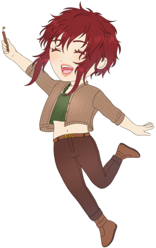

¡Hola! Soy Raissa Ozsari (nombre artístico), me gusta dibujar y contar historias. Desde niña me interesó mucho el mundo de la animación, pero era un proceso largo y complicado que por mí misma me daba un poco miedo realizar. Después, descubrí que todas esas animaciones venían de algo mucho más simple, algo creado casi siempre por una persona… ¡Los cómics! Dibujos en secuencias para contar una historia disponiendo de tan solo lápiz y papel.

En casa siempre hay estos elementos, y así fue como comencé a dibujar. Hubo un tiempo donde me dedicaba más a escribir, pero poco a poco fui aprendiendo más cosas, hasta que finalmente descubrí que no tenías que ir a una editorial para dar a conocer tu trabajo (lo intenté con novelas, y pensaba que sería así de complicado siempre). Encontré los webcómics y así me lancé a crear un par de historias que dieron paso a mi ahora gran proyecto: Amber Heart, el cual de momento está en un reboot.

Y aunque me gusta invertir mi tiempo en aprender y a mi trabajo, hay tantas cosas, trucos y más que a veces no uso y que sé que otras personas pueden darle uso. No solo eso, al ser algo que de este lado del mundo no es tan conocido, muchas personas se pueden sentir perdidas en el camino y no saben cómo dar el primer paso para dar a conocer sus historias también. Así es como decidí también crear el blog y ayudar en lo posible a aquellos novatos que pueden sentir miedo y no animarse a dar su historia a conocer.

Si te gusta mi trabajo, no dudes en seguirme en mis diferentes redes sociales donde encontrarás aún más contenido. También puedes apoyarme o convivir conmigo en las diferentes plataformas que te dejo a continuación:

- [Instagram](https://www.instagram.com/raissaozsari)
- [Twitter](https://twitter.com/raissaozsari)
- [Tiktok](https://tiktok.com/@raissaozsari)
- [Youtube](https://youtube.com/@raissaozsari)
- [Pinterest](https://pinterest.com/raissaozsari/_created)
- [Facebook](https://facebook.com/ozsariraissa)

Y por supuesto, no olvides revisar el blog donde encontrarás consejos y herramientas si te interesa hacer tu propio cómic. ¡También encontrarás mi trabajo aquí que podrás leer gratis y antes que cualquiera!!

 

