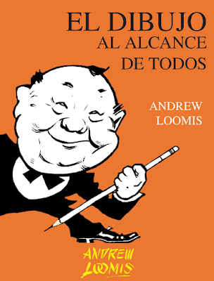
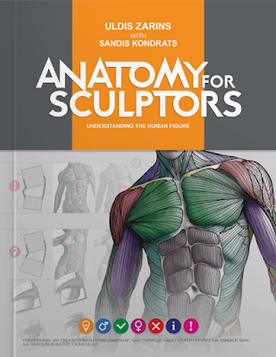
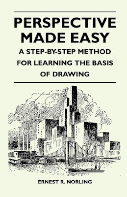
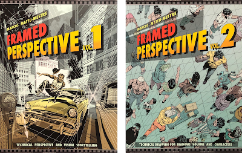
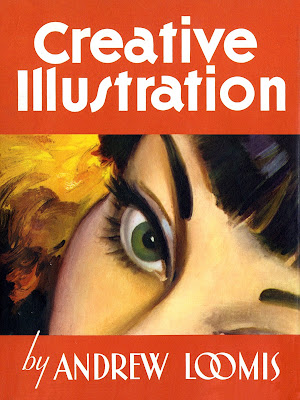
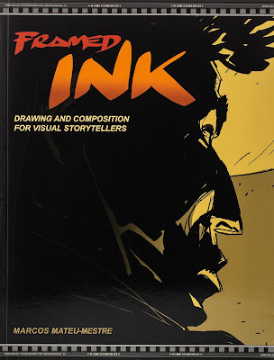
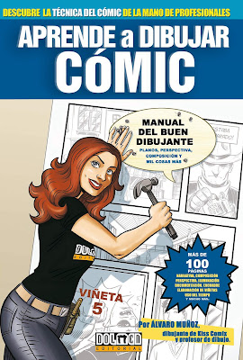
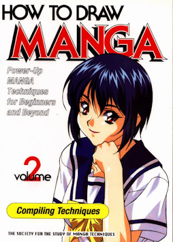
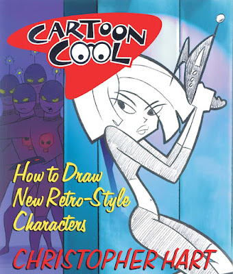

No solo te dejo unos libros para aprender a dibujar, sino también algunos que te pueden ayudar para hacer cómics, ya que abarcan diferentes temas, como composición, creación de personajes y muchas cosas más.

No descartes aprender por este método, puesto que así tienes control del modo en que adquieres conocimientos, deteniéndote el tiempo necesario en saber algo nuevo y volver de modo rápido para repasar.

Los libros que te dejo a continuación son de los cuales he ido aprendiendo y sigo aprendiendo, vuelvo a ellos cada vez que lo necesito para refrescar algo o por si olvidé alguna cosa en el momento en que los leí.

 

**[El dibujo al alcance de todos – Andrew Loomis](https://mega.nz/file/e5hxERbA#QUdJF1KD2FSdKmZHBqUJPYQCBPCbdqH1nvswVsvykBY)**

Este es un libro bastante amigable para aquellos que quieren aprender a dibujar sin previo conocimiento. Comienza de un modo para nada técnico, por lo que *cualquiera*puede aprender de él, y está precisamente diseñado para esto: con los conocimientos necesarios y práctica puedes aprender este arte.  
Te ayudará a perder el miedo a no hacer nada por «no saber dibujar», es el mejor modo para introducirte a ser dibujante. Aunque su estilo es bastante clásico o vintage, muchas de las bases que Loomis nos muestra se siguen usando hoy en día, por ejemplo, el método Loomis para construir cabezas es bastante usado y es el que uso cuando dibujo.

 

**[Anatomy for Sculptors – Uldis Zarins con Sandis Kondrats](https://mega.nz/file/y8gVmarJ#Ma2JDaC1_GopXU4Az-s5GL_3moiT63LeSD_PklQGZDY)**

Aquí puedes aprender anatomía, aunque su nombre indica que es para escultores, en realidad no trata de trabajar con esta técnica. El libro te muestra a detalle, con ayuda de fotografías e imágenes 3D, todos los músculos. Lo mejor es que divide los grupos musculares por colores, así los entiendes con más facilidad. El libro es bastante completo para iniciarte en anatomía y es un libro que me hubiera gustado poder encontrar antes.

 

**[Perspective made easy – Ernest R. Norling](https://mega.nz/file/b1xkXA5B#FRLf90HmpmwRqRj5ilAFjr2GYNBxJ3D4-66ds5OzyOE)**

A muchos la perspectiva es el primer gran reto al que nos enfrentamos, y Norling nos demuestra en este libro que en realidad es más fácil de lo que parece. Es un libro bastante amigable que nos guía paso a paso para poder construir el mundo que nos rodea sin dificultad. Te sugiere ejercicios que puedes realizar y así perder el miedo a la perspectiva y sacar todo tu potencial.

 

**[Framed Perspective – Marcos Mateu-Mestre](https://mega.nz/file/expUHTia#f7YtId5WoFXCNhUdlILMprAvmwpD_7gq6ih30858pDQ)**

Si el libro anterior te pareció poco, aquí ya puedes comenzar a incluir la perspectiva de modo más avanzado. Aquí está más enfocado para usarlo para contar historias, así ya puedes usarlo para crear tus cómics. Sin embargo, si estás empezando es mejor ir al primero y luego continuar con este.  
Tienes dos volúmenes, así que estúdialos con calma.

 

**[Creative illustration – Andrew Loomis](https://mega.nz/file/D1AiQRLY#YEMw3kOMew4u81SKaq7YVbRkFtAptYLsvsxvgUd5fNY)**

Andrew Loomis tiene varios libros, pero el anterior que te mencioné de él y este son los que considero más útiles te pueden ser. En este, aunque está enfocado especialmente para crear ilustraciones, el mismo conocimiento lo puedes aplicar para componer paneles para cómics, ya que muchas de las reglas son las mismas.  
Si eres bastante curioso y de experimentar, seguro te encantará ver todo el contenido y modo en que puedes crear paneles. Lo considero un complemento al siguiente libro que te dejo.

 

**[Framed Ink – Marcos Mateu-Mestre](https://mega.nz/file/vgx1VLxR#kCIzne_ZnXe8RcaEDqOyrKl_GGS8JvTTb9aNif1iB8Y)**

Al igual que el libro anterior que te dejé de este autor, este también está especialmente enfocado para crear cómics. Aprenderás a crear escenas con un verdadero propósito, a usar la cámara para crear continuidad y a componer paneles de mejor modo. Tal vez pueda parecer un libro corto, pero va directo al grano y su contenido preciso te ayudará a entender mejor cómo crear tu historia sin tener que dar tantas vueltas adivinando qué hacer.  
Por supuesto, quizá te preguntes si esto te servirá para trabajar en un formato vertical: ¡claro que sí! Aunque algunos detalles cambian por el formato, la mayoría del contenido igualmente te sirve.

 

**[Aprende a dibujar cómic – Editorial Dolmen](https://mega.nz/folder/zlRXQaYb#g-DGVGEUbUWcozJHBbcbPg)**

Esta es una serie de libros que abarcan diferentes temas. Aprenderás desde lo más básico, como aprender a dibujar figuras humanas, pasando por los tipos de paneles, storytelling, composición y mucho más. En varios de ellos encuentras consejos de profesionales y, aunque seas más de un estilo manga o asiático, si no apuntas a esta clase de dibujo, muchos de los otros consejos te servirán para crear historias.

 

**[How to draw manga](https://mega.nz/folder/75pVhBrZ#LYMmLiatXxzi5x4GALnsuw)**

Esta es una serie de libros que, al igual que *Aprende a dibujar cómic*, recoge variedad temas, desde aprender a dibujar cuerpos, objetos, utilizar herramientas y más. También hay temas según el género, como aprender a dibujar parejas o peleas. Si eres más de este estilo, también encuentras apartados para aprender a usar tramas (aunque de modo tradicional).  
Reconocerás estos libros por su logotipo, ya que al tener un título un poco genérico encontrarás otros llamados similar, así que fíjate bien que se trate de esta serie.

 

**[How to draw New Retro-style – Christopher Hart](https://mega.nz/file/y4xFRSoI#As8yAB8R_IRDNC3vq7pXzaviPCdxJkh6BpjyYM9s0ac)**

Este libro lo dejo como un extra para aquellos que les gusta diseñar personajes. Quizá no es un estilo que encuentres seguido, especialmente en plataformas como Webtoon o en un estilo manga, pero si buscas aún tu estilo de dibujo, eres curioso o simplemente te gusta ojear libros como a mí, vale la pena verlo. Tal vez te servirá si aún estás aprendiendo a dibujar, ya que te muestra cómo crear personajes a partir de formas básicas.  
Me encanta este estilo, me recuerda a series como Los padrinos mágicos y me encantaría hacer algún cómic así, ja, ja.

Espero que te sirvan estos libros, te pido que los complementes con lo que te dejo en las entradas de canales de YouTube.  
Si tienes algún libro que recomendar, lo dejas en los comentarios, ¡me gustaría verlo!