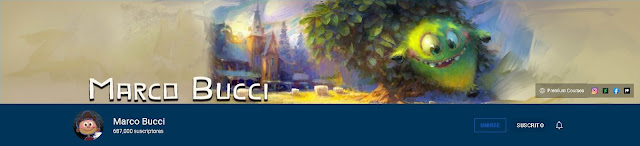
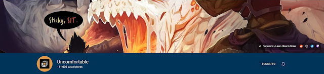
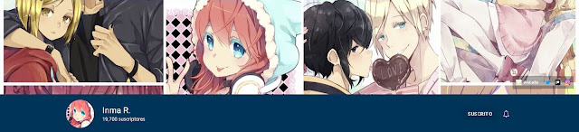
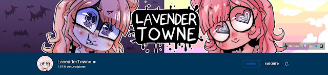
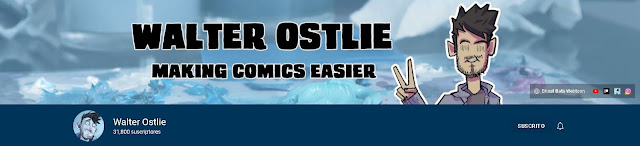
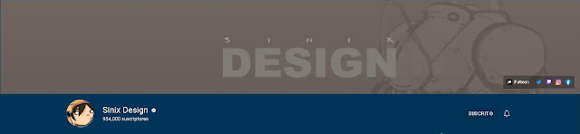
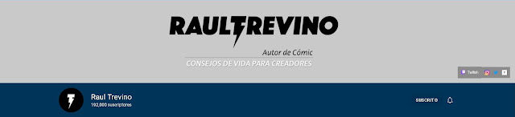

En esta entrada te dejo canales de youtube excelentes para aprender a dibujar. A pesar de que muchos no tengan recursos para asistir a una escuela de arte, con acceso a internet tienes infinidad de información a tu disposición. El gran problema es encontrar la información correcta en ese mar extenso de conocimiento.

Los siguientes canales me han ayudado de un modo u otro, bien por lo que enseñan o por el modo en que transmiten su conocimiento. En algunos aprenderás a dibujar y en otros te servirá la información para aplicar a tu nueva carrera, tales como curiosidades o consejos que puedes aplicar a tu día a día para enfrentar este nuevo camino.

### [Marco Bucci](https://www.youtube.com/@marcobucci)

Este canal lo encontré cuando buscaba información sobre teoría del color, por lo que lo recomiendo en especial si tienes problemas en entender el color y el cómo aplicarlo a tus trabajos. Su lista 10 minutes to better painting es sin duda mi recomendación especial. Encontrarás en especial información para trabajar en medios digitales, pero mucha de esta puede ser aplicada en medios tradicionales.

El canal está en inglés pero algunos tienen subtítulos que la plataforma misma te traducirá sin problema para que puedas entender lo que ves en pantalla.

### [Draw-a-box](https://www.youtube.com/@Uncomfortable)

Si buscas comenzar a dibujar desde cero y no tienes recursos para pagar un curso, esta es una muy buena opción. Aprenderás desde lo más básico de un modo sencillo, con ejercicios básicos que, aunque parezcan simples a primera vista, son bastante desafiantes. Si crees que la perspectiva es algo difícil de aprender, entenderás aquí que es más sencillo de lo que parece.

El canal también se encuentra en inglés, y esta comunidad cuenta con su propio canal de discord donde te ayudarán todavía más en aprender.

### [Every Frame a Painting](https://www.youtube.com/@everyframeapainting)

Componer una imagen es algo difícil, pero este canal te ayudará a entenderlo mejor. Análisis de películas para que puedas entender la intención de los directores y así desarrollar de un modo más fácil tu nueva obra. Te explica de un modo bastante claro la manera en que se compone una imagen.

Otro canal más en inglés (¡lo siento!), pero también cuenta con subtítulos en español.

### [Inma R.](https://www.youtube.com/@InmaPollito)

Aquí comenzamos a entrar a terreno de cómics, e Inma sabe bastante cómo realizar un webtoon. Ella te dará consejos para dibujar en estilo anime y a utilizar Clip Studio Paint. Aprendí mucho con ella y aún uso varios de los trucos que ella indica en sus vídeos.

El canal lo tienes en español, no hay mucha variedad más allá de sus trabajos y sus tutoriales, que aunque estos últimos son pocos, la información es realmente valiosa.

### [LavenderTowne](https://www.youtube.com/@LavenderTowne)

Este canal es bastante variado, encuentras sus blogs, tutoriales y mucho más. LavenderTowne tiene un estilo artístico bastante peculiar, pero que eso no haga que des un paso atrás, te hablará de su paso por la escuela de arte hasta su actual trabajo haciendo su cómic, por lo que encontrarás muchas cosas que te servirán, por lo que te invito a darle un vistazo a su canal.

Está también en inglés.

### [Walter Ostlie](https://www.youtube.com/@walterostlie)

Este creador de cómics te presenta de modo fácil cómo crear tu obra, pasando de todo como tipografía hasta cómo hacer fondos de manera más rápida. En este canal sabrás de verdad cómo crear una novela visual y tu webcómic.

Aunque está en inglés, sus explicaciones son bastante dinámicas y junto a los subtítulos, encontrarás que hay mucho más allá por descubrir. En este canal encontré muchos trucos que han ayudado a que trabaje mucho más fácil en mi cómic, por lo que es uno de mis mayores recomendaciones si vas a incursionar en el mundo de los cómics y las novelas gráficas.

### [Proko](https://www.youtube.com/@ProkoTV)

Sin duda el mejor canal para aprender a dibujar. Se especializa en anatomía y figura, pero encontrarás también vídeos de invitados que te enseñarán muchas cosas más. También está su página web donde encontrarás muchos cursos, con una gran comunidad.

Aunque está en inglés, en su página web encontrarás cursos con subtítulos en español. Los invitados cubren una gran variedad de temas, desde lo más básico hasta complejas esculturas, te hablarán sobre sus trabajos en grandes empresas y más, por lo que te faltará incluso tiempo para poder ver todo. Un canal muy activo y te lo recomiendo sin importar a lo que te vayas a dedicar en el arte.

### [Sinix Design](https://www.youtube.com/@sinixdesign)

Sinix tiene una gran diversidad de vídeos, pasando sobre cómo usar el color, anatomía y mucho más. Un solo vídeo te entrega mucha información que solo verlo una vez no bastará, y su gran cantidad de vídeos subidos te dará información para absorber por mucho tiempo.

Lamentablemente también está en inglés, pero al igual que los demás, encuentras datos valiosos que nadie más te ha dicho, por lo que vale la pena dedicarle unos minutos a sus vídeos.

### [Raul Trevino](https://www.youtube.com/@TrevinoArt)

Este creador de cómics, aunque un poco ausente, tiene grandes vídeos que te servirán para crear cómics y sobrevivir a esta jornada de dibujante. Algunos de sus vídeo blogs te darán la fuerza para continuar y te inspirarán a seguir creciendo. Aunque relacionado al arte, te lo recomiendo un poco más para inspirarte.

Sin duda hay muchos más canales que podría recomendarte, pero estos son los que se me vienen a la mente por el momento. Quizá el auge de nuevas plataformas y otros formatos hagan que deje fuera muchos artistas, más estos son los que me han acompañado en mi jornada y a los que vuelvo una y otra vez cuando lo necesito.

Si conoces algún canal del que quieras contarnos o que me recomiendes, estaré atenta a tu comentario, ¡quizá pueda sacar otra entrada con nuevas recomendaciones!

Y si buscas algo en específico, no olvides mencionarlo para ayudarte a encontrarlo ♥