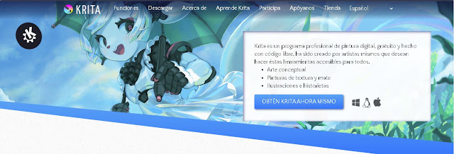
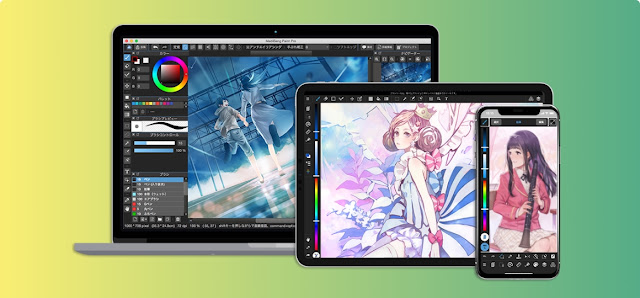
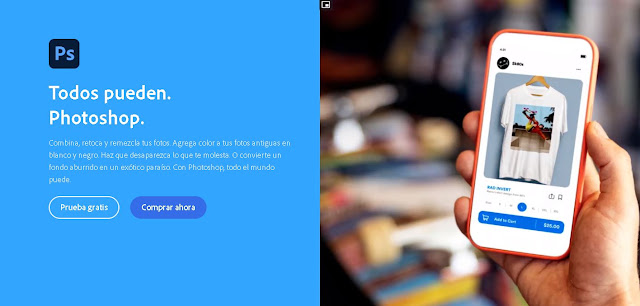
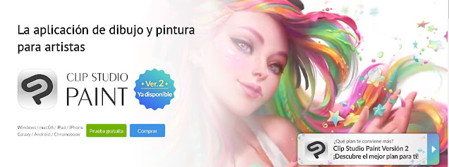
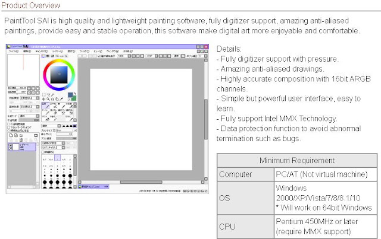
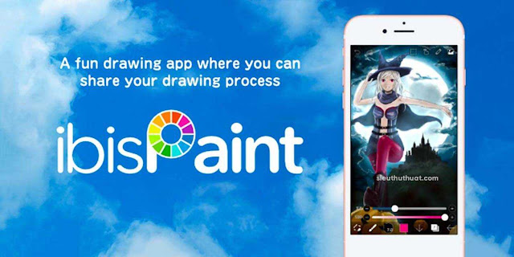
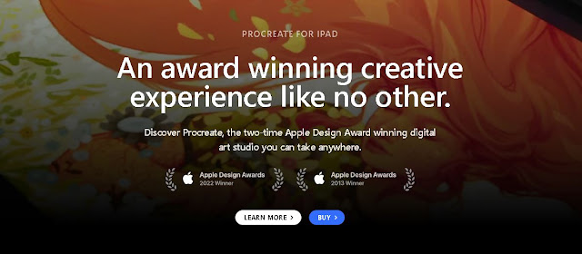
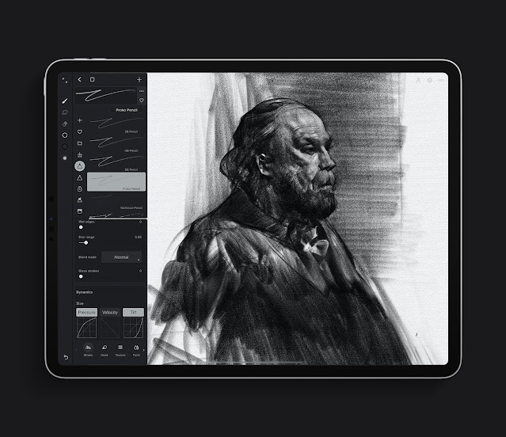

Además de los obvios papel y lápiz, tintas y pinturas, hay muchos programas en los que puedes crear tu obra. Si tienes como mínimo un teléfono móvil con pantalla táctil, puedes comenzar a crear tu obra de inmediato.

Por supuesto, si dispones de una computadora, tableta gráfica o tablet con stylus, o el ya mencionado smartphone, solo bastaría encontrar una interfaz cómoda para trabajar. Hay muchas maneras de utilizar estos programas a favor, incluso si trabajas tu obra tradicionalmente. Aquí encontrarás un plus para mejorarlo.

### [Krita](https://krita.org/es/)

 
Krita es un programa **gratuito** que te ofrece muchas herramientas para poder trabajar tus ilustraciones y, en lo que nos concierne, cómics. Incluso puedes realizar animaciones, aunque algunas funciones se pueden ver limitadas por una o varias razones. Se ha vuelto bastante popular no solo por su accesibilidad, sino por sus herramientas que te ofrecen grandes resultados.
 
Se encuentra disponible para computadoras y no tienes que pagar nada por él.

### [Medibang | FireAlpaca | Jump Paint](https://medibangpaint.com/es/)

 
Medibang es un software creado en Japón, en el cual puedes realizar ilustraciones, cómics y **mangas**. Del último, encontrarás una librería llena de recursos que te permitirán crear tus obras con este estilo. Encontrarás desde fondos y pinceles hasta tramas para darle vida a tu manga. Si también deseas crear un trabajo a color como un webtoon, también dispones de muchas herramientas para esto.

El programa se encuentra disponible para todos los dispositivos y es gratuito, aunque también ofrece una versión premium que cambiará sus beneficios según el dispositivo que uses. Lo mejor de este programa, es que la empresa ofrece un apartado donde puedes compartir tus obras, bien sean mangas o ilustraciones y en muchas ocasiones realizan concursos y darte a conocer a todo el mundo. Aquí encuentras **ArtStreet** para compartir tus ilustraciones, y la nueva **MangaCreators** Plus donde puedes subir tus cómics y mangas.

Jump Paint y FireAlpaca son de la misma empresa y tienen casi el mismo fin. Por ejemplo, Jump Paint fue más bien diseñado para crear mangas, pero eso no lo limita a la creación de estas obras, pero encontrarás herramientas un poco más específicas si es lo que estás buscando.

### [Photoshop](https://www.adobe.com/la/products/photoshop.html)

 
Photoshop está especialmente diseñado para el retoque de fotografías, y eso es lo que lo hace un interesante programa para dibujar. Tiene una gran variedad de herramientas que pueden acelerar considerablemente el proceso de dibujo. Personalmente, su herramienta de edición de texto es un plus que no ha podido mejorar el programa que uso actualmente, pero además de eso, encuentras filtros para modificar fotografías y muchas cosas más. De seguro puedes sentir las primeras veces que tanta herramienta te saturará, y es verdad, no siempre llegas a usar todo el arsenal, pero es bastante completo si lo ves desde otra perspectiva.

El programa se encuentra para varios dispositivos, aunque su versión más completa se encuentra en la versión de PC, ¿lo malo? Su alto **costo** y su modelo de suscripción. En algunos equipos puede hacerse algo pesado, por lo que necesitas disponer de una buena computadora para un uso fluido.

### [Clip Studio Paint](https://www.clipstudio.net/es/)

 
El programa más **completo** y mi recomendación personal. Encuentras dos versiones, aunque con la Pro tienes más que suficiente para crear ilustraciones y cómics. La versión EX tiene herramientas interesantes como la conversión LT para volver tus fotografías a estilo manga.
Su gran **librería de assets** es lo que hace este programa la mejor inversión, donde hallarás toda clase de herramientas, desde pinceles para entintar, hasta objetos 3D que te ahorrarán horas de trabajo. Muchos de los assets son gratuitos y otros puedes adquirirlos con moneda del programa, Clippy, los cuales obsequian de vez en cuando, o con Gold, los cuales cuestan dinero real.

El programa lo encuentras para todos los dispositivos, eso sí, solo en la versión de PC lo encuentras de pago único y en los demás bajo **suscripción**. Si tienes móvil, te dan una hora gratis de uso más no puedes guardar el archivo. A pesar de todo eso, es la mejor herramienta que puedes encontrar y de seguro más de uno te la habrá recomendado. Eso sí, no tienes que adquirir este programa para mejorar tu obra, todo eso dependerá de tu talento ♥

También tienes un apartado para subir tus obras incluido el formato Kindle, además de algunos concurso en los que también puedes participar. No solo eso, sino que también puedes ganar dinero creando tutoriales de los cuales te informarán mes a mes para que hagas parte.

### [Paint Tool Sai](https://www.systemax.jp/en/sai/)

 
Paint Tool Sai es otro programa **gratuito** (que en realidad es de paga LOL) que se ha hecho su hueco entre los artistas. Es un programa bastante complejo a su modo, aunque liviano para correr en computadoras poco potentes. Muchos artistas realizan aquí sus trabajos y con un gran resultado, aunque es poco conveniente para trabajar archivos grandes, por lo que si realizas webtoons, recuerda tenerlo en cuenta para evitar problemas después.
El programa lo encuentras para **computadoras**.

### [Ibis Paint](https://ibispaint.com/?lang=es)

 
Otra opción bastante reconocida por los artistas. Empezó como una aplicación para **dispositivos móviles** y ahora cuenta con su versión para **PC**. Aunque puedes usarlo **gratuito** y con la intermisión de anuncios, también cuenta con una versión de pago bastante asequible. La comunidad es la que hace aún más grande esta aplicación, y encuentras gracias a ella pinceles para sacarle todavía más provecho a esta fabulosa herramienta.

### [Procreate](https://procreate.com)

 
Si cuentas con un **iPad**, esta aplicación sin duda es una de las más recomendadas. Su variedad de herramientas te permitirá crear hermosas ilustraciones, y por supuesto, cómics y webtoons. Aunque al principio encuentres pocos pinceles, puedes descargar muchos en la web, y así crear tu propia librería a gusto.

Lo malo es que puedes verte un poco limitado al lienzo y la cantidad de capas que el programa te deja crear, por lo que debes ser muy organizado para no quedarte a medias en tu trabajo. Personalmente lo utilizado para crear bocetos ya que los pinceles tipo lápiz que tiene ofrecen un trazo bastante realista, y el poder utilizar gestos permite trabajar con un poco más de rapidez que con el teclado.
El programa es de **pago** pero es muy asequible, no tienes que suscribirte a nada.

### [Infinite Painter](https://www.infinitestudio.art/discover.php)

 
Esta aplicación es exclusiva de **dispositivos móviles**, y puedes usarla de manera **gratuita**. Encuentras gran variedad de pinceles y herramientas que puedes aprovechar para poder realizar tus obras. También cuenta con una versión premium por si deseas apoyar a los desarrolladores y evitar los anuncios.
 

Por supuesto, puedes que encuentres todavía más herramientas que variarán según el dispositivo que uses, y como ya mencioné, de seguro te bastan papel y lápiz para poder crear tu obra. Tampoco tienes que invertir dinero si no lo tienes, el mejor recurso que tienes es el tiempo, y si eres dedicado, puedes hacer magia con tan solo un lápiz y deslumbrar a todos.

Ningún programa es mejor que otro y cada cual se ajustará a las necesidades de su usuario, tal vez para algunos cierto programa resulta poco, o por el contrario, demasiado, y lo mejor es adquirir algo que vaya a tus necesidades y no algo por moda o por presión.
 
Si tienes alguna duda sobre cuál debes adquirir, puedes dejar un comentario y te guiaremos en escoger el mejor programa para ti.
Y si tienes también alguna sugerencia o hablar sobre tu experiencia con alguno de ellos, ¡me encantaría saberlo!
 
 
 