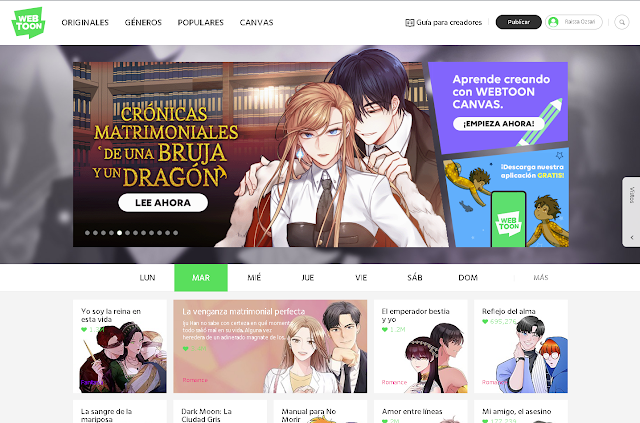
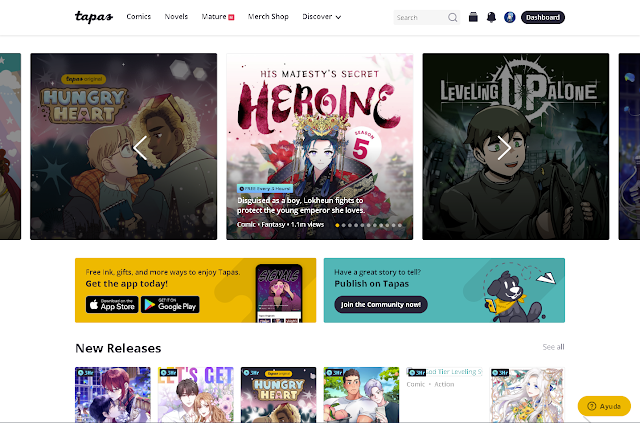
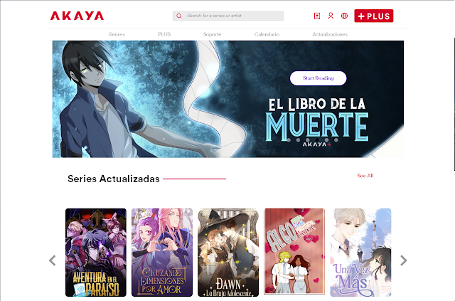
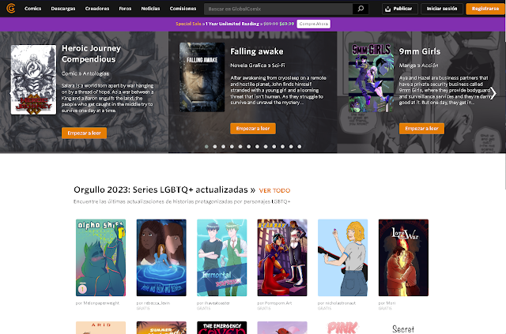
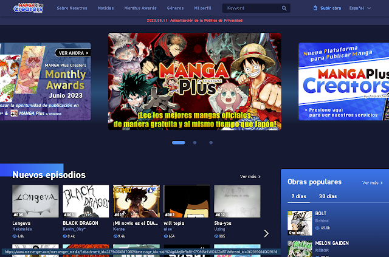
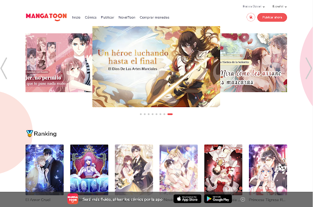

Aunque hay varias plataformas en las que puedes publicar tu cómic, encontrar la mejor opción puede ser ya un poco más complicado.

Eso no significa que debas apegarte a una sola, y por el contrario, es recomendable publicar en todo lugar que puedas y así tener mejor alcance. Sin embargo, algunas cuestiones como el formato o la censura pueden hacer que desistas de publicar o hasta de siquiera continuar tu historia, por lo que no solo te daré una lista de sitios web sino también un vistazo a su público. Esto te servirá para saber qué esperar de cada sitio y así ofrecer tu contenido sin desesperar.

### [Webtoon](https://www.webtoons.com/es/)

La plataforma más grande y conocida para publicar webcómics. Nacida en Corea del Sur, su público objetivo son jóvenes adolescentes. Aunque su plataforma indica que debes tener un mínimo de 13 años, de seguro encontrarás a niños de 10 años o menos por aquí, lo que lleva a que la plataforma ejerza una fuerte censura.

Por supuesto, encontrarás adultos que disfrutan también de la variedad de obras que aquí se publican, pero sin duda su mayor público son mujeres interesadas en romance.

Notarás que la gran mayoría de obras tratan temas de amor, pero eso no significa que encuentres obras de terror, acción, drama y comedia, entre otros. Sin embargo, la mayor queja será que la plataforma está enfocada en romance. Dicho esto, es probable que una obra con un tema serio, adulto, difícilmente destaque, y si tocas temas bastantes fuertes como drogas, abusos y más, es probable que te ganes uno de los famosos baneos de Webtoon.
Lo mejor es no intentar pelear contra el gigante de Webtoon, siempre saldrás perdiendo, y aunque muchos estemos en contra de esta censura, que a veces llega a ser bastante arbitraría, puedes usar esta plataforma como medio para dar a conocer tu obra y ofrecer el contenido completo en otra que sí te lo permita. Esta es una tarea que debes en cuenta para tu estrategia.

De seguro habrás escuchado de los Originales de Webtoon, obras que pasaron de la sección Canvas (donde cualquier usuario puede subir una obra) a Originales (promocionadas por Webtoon), de seguro es algo llamativo para ti, pero eso lo profundizaré en [este post](/blog/posts/2023-10-16-es-webtoon-para-mi).  La posibilidad de ser pagado por tu cómic suena interesante, para algunos puede ser un pro, más no olvides leer el post y saber la verdad tras eso.

#### Pros:

- Mayor alcance para tu obra.
- Probabilidad de conseguir un contrato.
- Monetización por medio de anuncios.
- Perfil de creador para interactuar con los lectores.

#### Contras:

- Censura.
- No puedes publicar obras con temas delicados ni mucho menos con ecchi o desnudos.
- Los requisitos para monetizar por anuncios son muy difíciles de lograr.
- Preferencia al formato vertical sobre el tradicional.

### [Tapas](https://tapas.io)

Después de Webtoon, es probable que hayas escuchado de Tapas. En cuanto público y obras es bastante similar, pero esta no es tan restrictiva como Webtoon. Aquí puedes publicar algunas de las cosas que Webtoon no te permite, y es que etiquetar tu capítulo como Adulto (Mature), es una gran ventaja que Tapas tiene frente a Webtoon.

Tapas es más amigable con el creador, te presenta un panel de control bastante completo que difiere del visto en Webtoon (el cual parece casi un chiste). Su sistema de etiquetas permite una mejor búsqueda de obras, por lo que tienes más de un modo de aparecer, y puedes monetizar tu obra por medio de anuncios que comenzarán a aparecer en cuanto logres ciertos requisitos.

Al igual que Webtoon, también puedes conseguir un contrato con la plataforma.

#### Pros:

- Monetización por medio de anuncios.
- Monetización por anuncios más accesible que el de Webtoon.
- Monetización por programa de creadores.
- Donación por parte de los lectores por medio de tinta (ink, moneda de la plataforma)
- Menor censura que en Webtoon.
- Perfiles de creador similares a una red social.

#### Contras:

- Menor alcance de tu obra.
- Interfaz en inglés.
- Preferencia al formato vertical sobre el tradicional, aunque muchas obras están en tradicional y tienen vistas.

### [Akaya](https://akaya.io)

Esta plataforma nacida en México le abre un espacio a los latinos para publicar sus obras. Es bastante similar a Webtoon, aunque aquí puedes publicar en diversidad de formatos.

No hay mucho más que destacar de la plataforma, es bastante similar a Webtoon y Tapas, aunque aquí puedes publicar también tus obras en formato tradicional. La app aún tiene mucho por mejorar, y para los creadores no hay mucho que ofrecer, ya que no tienes un modo de ganar dinero en la misma plataforma.

#### Pros:

- Publicación en varios formatos.
- Poca competencia, tu obra puede destacar.
- En español.

#### Contras:

- No hay monetización.
- Censura similar a la de Webtoon.
- Poco tráfico de lectores.
- La app tiene muchas cosas por mejorar (en mi caso, no puedo dar likes o comentar en las series)

### [GlobalComix](https://globalcomix.com)

Una plataforma algo reciente, creada con la finalidad de darle un espacio a los creadores independientes. Ofrece una gran cantidad de herramientas desde el momento en que te creas una cuenta. Su mayor atractivo es la libertad que le ofrece a los creadores, entendiendo que algunos elementos se usan con fines artísticos.

Próximamente saldrá una aplicación que esperemos aumente el tráfico, en la cual se podrán leer los cómics en formato tradicional, vertical, e incluso panel por panel.

Para los creadores hay un sinfín de herramientas y múltiples modos de monetizar, permitiendo incluso crear PDF en el propio sitio web (para cómics en formato tradicional), hay tanto que merece un post aparte, pero sin duda la mejor opción para creador.

#### Pros:

- Monetización sin requisitos.
- Múltiples modos de monetizar (acceso anticipado, venta de PDF, donaciones)
- Libertad creativa.
- Puedes subir un cómic en varios idiomas.

#### Contras:

- Pocos lectores en español.
- La interfaz puede ser un poco abrumadora.
- Suelo ver los mismos cómics en portada, no ayuda mucho a descubrir series.

### [Manga Plus Creators](https://medibang.com/mpc/)

Medibang, junto a Shueisha, crearon esta plataforma para darle un espacio a obras fuera de Japón, permitiendo publicar en inglés y español. Aunque se permite publicar en formato vertical, tendrás más ventaja si lo haces en formato tradicional y sentido japonés, con la lectura de derecha a izquierda. De igual modo, aunque no es restrictiva con los géneros a publicar, su preferencia es el shonen, por lo que si tienes un cómic de este estilo, es la plataforma ideal. Eso sí, ten en cuenta que hay reglas que seguir y sigue siendo bastante restrictiva con algunas cosas. Si lo tuyo no es el romance, es tal cual como Webtoon pero para acción y peleas.

Puedes participar en el concurso mensual y dar a conocer tu obra. No solo recibirás un premio metálico, sino también una publicación en las aplicaciones de Manga Plus y Jump+, sin embargo, recuerda leer las reglas. En [este post](#) puedes saber más al respecto sobre esos concursos.

#### Pros:

- Posibilidad de ganar dinero con el concurso mensual.
- Enfocado a manga shonen, un espacio para obras de acción.
- Si eres fan del manga, es el lugar ideal para utilizar este formato.

#### Contras:

- Preferencia al formato manga (lectura derecha a izquierda)
- Los lectores pueden ponerle un pero al formato vertical.
- Interfaz algo complicada.
- Seguir obras de varios capítulos es difícil.

### [MangaToon](https://mangatoon.mobi/es)

En esta plataforma puedes publicar tu obra gratis. Muy similar a las anteriores mencionadas, aunque personalmente no es mi favorita. Al igual que las otras plataformas, el público y el objetivo de la página ya están establecidos y en su mayoría se tiende al género de romance, aunque puedes conseguir obras de acción, terror y demás.

Al publicar, tu capítulo pasa por una revisión antes de que pueda ser mostrado a la plataforma, por lo que no tendrás que adivinar si algo es censurado como suele suceder en Webtoon. No llega a ser tan restrictiva como Webtoon, pero no tiene un sistema de monetización como las plataformas ya mencionadas. Aunque menciona que puedes ganar dinero, realmente no es mucho lo que puedas sacar.

#### Pros:

- La plataforma tiene alto tráfico.
- Variedad de géneros, la plataforma te deja escoger una preferencia entre romance o acción.

#### Contras:

- Poca visibilidad dentro de la plataforma, debes recurrir a medios exteriores para lograr visitas.
- Monetización con requisitos muy difíciles, lo que conlleva a que tu cómic esté perdido y no sea mostrado hasta que tengas contrato con ellos.
- La monetización no vale la pena.

Estas son algunas de las plataformas que yo utilizo, sin embargo hay algunas otras como Lezhin o Manta, aunque en ellas se puede publicar tan solo por medio de un editor que se interese en tu trabajo o bien que les hayas mostrado tu trabajo y que te lo acepten.

Aquí también están tan solo plataformas de un uso general, por lo que si buscas una donde puedas publicar contenido +18, con escenas atrevidas e íntimas, la lista se puede expandir todavía más, pero no las enumero aquí ya que no he publicado en ellas. Sin embargo, te dejo algunas de las que conozco:

Faneo.

Amilova.

TMO.También te dejo algunos sitios de los que he escuchado pero de los que no he podido profundizar:

- [Reizu Comics](https://reizucomics.com).
- [NamiComi](https://namicomi.com/es-la).

Y si conoces algún sitio y quieres compartirlo, ¡déjalo en los comentarios! Así podemos expandir esta lista todavía más.

¡A publicar!
