Imagínate tener la mejor ideal del mundo y confiársela a tu mente… Para que luego se te olvide a los cinco minutos 😂 Ya me pasó una vez y a día de hoy sigo sin recordar qué era 😢

Evita que eso te pase. Habrás visto que hay personas que andan siempre con una agenda, o personas que te recomiendan siempre llevar una libreta, precisamente para evitar que se olviden las cosas.

Alguna vez leí que la **mente es para generar ideas**, no para guardar **información**. Y cuando comienzas a poner eso en práctica, comienzas a ser más creativo. Tu tarea es **crear conexiones** entre esa información, para almacenarla ya tenemos las agendas y las computadoras.

Hoy en día hay una gran variedad de herramientas que nos ayudan a guardar y clasificar nuestras ideas, en especial con proyectos largos que necesitamos ordenar por su densidad y poder acceder a ellos con facilidad.

Aquí te dejo una lista de las que he utilizado y que conozco, además de contarte también para qué y cómo las utilizo 😄

### Agendas y libretas de papel.

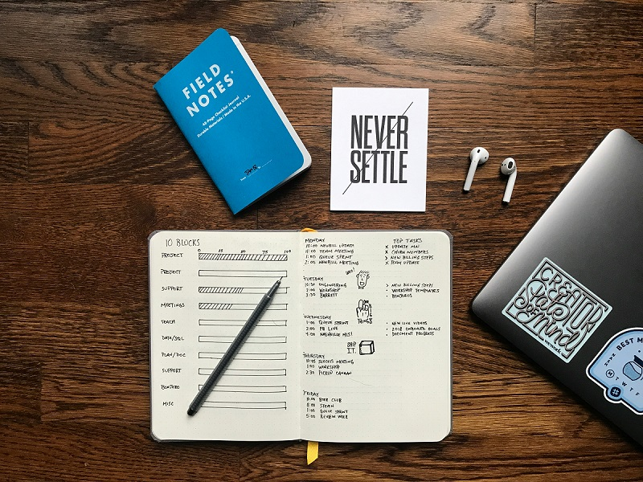

Es lo primero que se nos viene a la cabeza. Hay personas que lo llevan más allá y lo llevan tipo *journaling*, donde lo decoran y organizan todas las hojas de modo que parece un libro, cada uno con su página marcada y secciones para anotar cosas en específico.

Yo tengo una pequeña agenda con un elástico donde le cuelgo el bolígrafo, tan solo le dibujé una portada y voy anotando cosas a medida que se me ocurren, para luego pasarlas a alguna de las otras apps que utilizo.

Si te interesa más utilizar una agendita para esto, encontrarás en YouTube una variedad de vídeos.

No hay mucho misterio, pero como te menciona antes, hay gente que lo llevan un pasito más allá. No me gusta tampoco complicarme mucho, pero el método [Bullet Journal](https://www.youtube.com/@bulletjournal/videos) te puede llamar la atención si te buscas algo con más orden.

### Google Docs, Word.

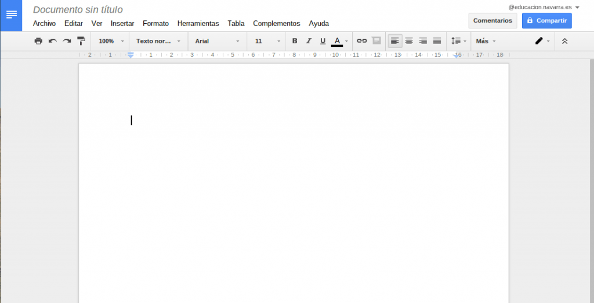

Gratuitos, siempre presentes y al alcance de todos. Son conocidos por la mayoría y no hay mucho que decir.

Generalmente lo utilizo para hacer un primer borrador de una historia que me vino de repente a la cabeza, también casi siempre desde el celular, por lo que van con un montón de errores y poco orden, pero ya que tengo el móvil en la mano, lo uso para eso.

No me gusta para escribir documentos largos, se comienzan a colgar en la PC y para las novelas prefiero utilizar otras aplicaciones. Sin embargo, me siguen ayudando siempre.

Antes de seguir, también cabe recalcar puedes utilizar las aplicaciones de notas que vengan en tu dispositivo, según si eres más de ideas pequeñas o de anotar hasta el color de las sábanas de la cama de tu personajes, puede que necesites uno u otro programa, ¡pero evita dejarle toda la tarea a tu cerebro!

### [Evernote](https://evernote.com/es-es).

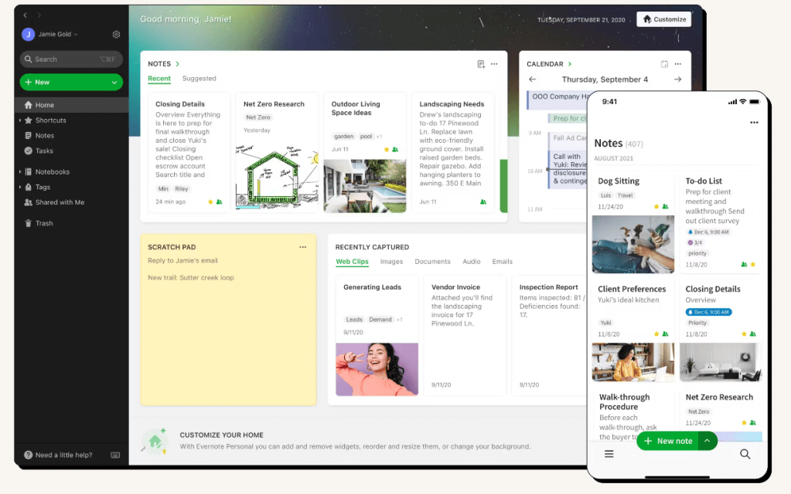

Fue de las primeras aplicaciones que utilicé. Permite ordenar por cuadernos, por lo que si llevas varios proyectos a la vez, sirve para clasificarlos.

Allí anoté mis ideas y un vistazo a cada capítulo, además de ordenar las fichas de personajes, y como permite subir imágenes, me permitía recordar las cosas con más facilidad. También permite estilizar el texto y a día de hoy tiene ya muchas funciones.

La dejé de lado porque eran ya un poco insistentes con que adquiriera la membresía, también porque comenzó a quedarse un poco atrás para lo que necesitaba.

### [Notion](https://www.notion.so/product).

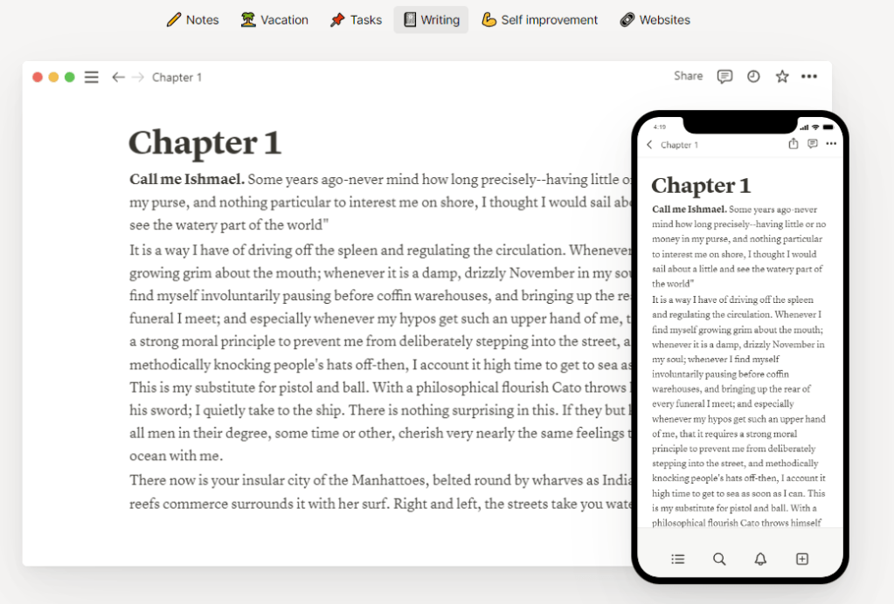

Notion es una aplicación bastante completa.

Quizá demasiado y puede ser difícil acostumbrarse a ella. Yo tardé dos años en entenderla, más que nada en parte por floja y no darme a la tarea de buscar tutoriales 😆 No la uso como tal para almacenar las ideas, sino para clasificar otro contenido.

Tiene base de datos y permite crear espacios para trabajar en equipo, incorpora también un calendario y las funciones le dan muchas más características.

Yo la uso principalmente para llevar control de las publicaciones en redes sociales y hacer seguimientos de mis cómics, utilizándola como gestor de proyectos gracias a las plantillas que he adquirido (y las que fueron que hiciera que me adhiriera finalmente a Notion).

Se puede utilizar para crear una Wiki, lo cual destaco más que nada para proyectos complejos, o por si deseas publicarlo y compartirlo con tus seguidores (un sitio web gratis, así).

Si trabajas con más personas, te puede ser realmente útil. Deja hacer muchas cosas en su versión gratuita, aunque sus apps de móvil y tablet no son tan buenas y me hacen sufrir en especial en el iPad.

### [Trello](https://trello.com/es).

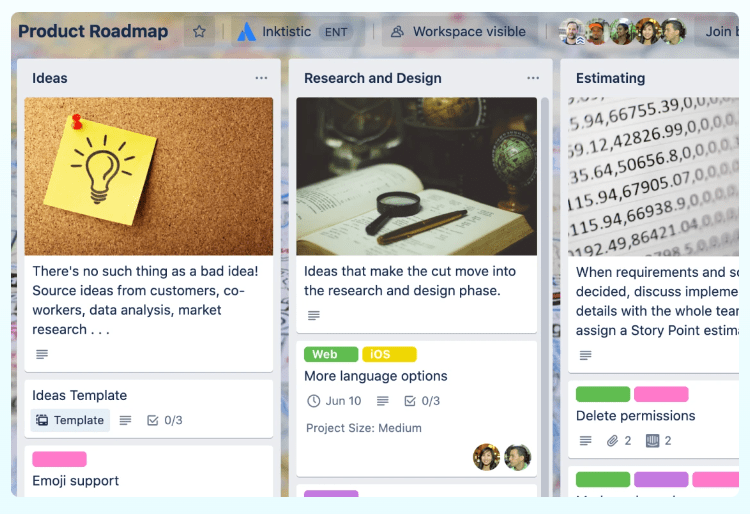

Trello es más que nada un gestor de proyectos.

También lo utilicé para ir llevando cuenta de los lugares donde ya había publicado el cómic y qué poner en las redes sociales. También permite trabajar en equipo.

Hay una similar, llamada Asana. En su tiempo las utilicé para saber más o menos cuánto tiempo gastaría en cada capítulo del cómic, organizando las actividades por los tramos que suelo hacer: storyboard, hacer fondos, montar viñetas, etc.

No la usé nunca para anotar ideas, pero la considero una buena herramienta por si necesitas gestionar tus tareas y en especial si trabajas en equipo.

### [Milanote](https://milanote.com).

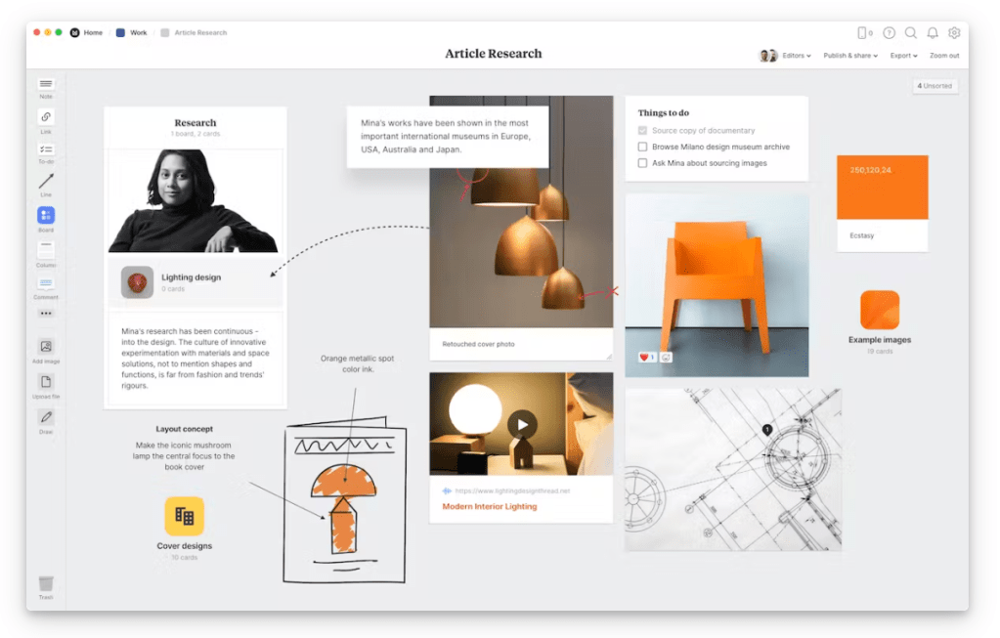

Esta es una de mis favoritas. Te permite ordenar por tableros como si fuera uno de esos donde pegas las fotografías y las notas, haciendo conexiones y moviendo y arrastrando todo cada vez que lo necesites.

Me gusta en especial por permitirte visualizar todo, y tiene plantillas que te pueden dar ideas para ordenar tus notas. Hay unas incluso dedicadas a la creación de novelas y cosas de este estilo, por lo que es muy útil.

Eso sí, tan solo deja crear 100 tarjetas, y en mi caso se me fueron la mitad en subir las imágenes que usé para inspirarme para los fondos de Anemoia. Lo bueno es que puedes subir el número al invitar más personas, o simplemente pagar la suscripción.

### [Miro](https://miro.com/es/).

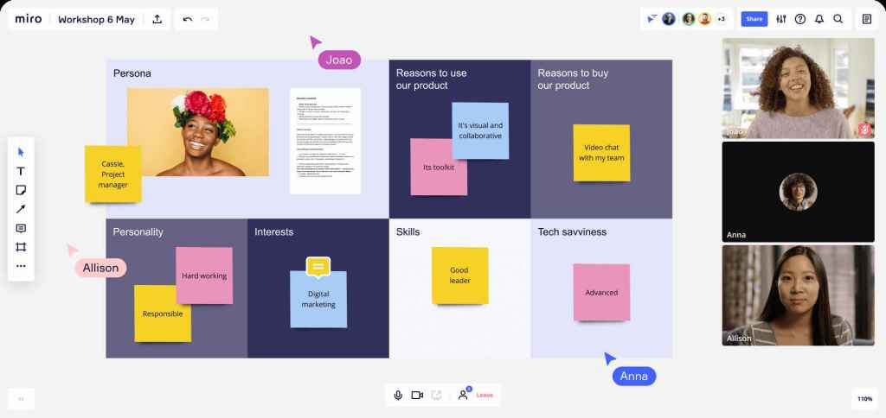

Miro es como Milanote, pero que no te limita tanto a la hora de subir tus archivos.

Funciona bastante similar, la he visto en personas que la utilizan para crear presentaciones, ya que permite compartir y trabajar en equipo.

También permite crear tableros con conexiones y adjuntar imágenes y notas, por lo que si eres más del estilo del tipo del meme, te va a encantar.

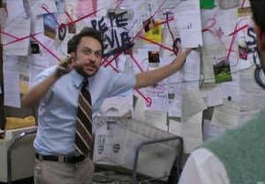

### [Concepts](https://concepts.app/en/).

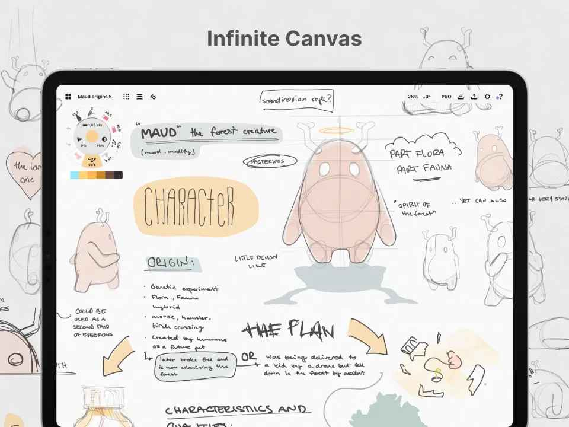

Ya que estamos con las apps del estilo lienzo infinito, me gusta mucho Concepts también.

Tienes una enorme hoja para llenarla con todas las ideas que se te ocurran en la cabeza, y es útil en especial si eres una persona que no le importa tanto tener orden.

Me gusta principalmente para cuando comienzo un proyecto y busco ideas, dejándolas nacer y evitando que el cambiar de página me detenga el flujo de trabajo.

Tiene varias herramientas y se deja personalizar bastante. A mí me gusta trabajar en una hoja con color y un lápiz azul para ayudarme a entrar más a ese modo de “estoy buscando ideas” y no buscar la perfección.

Está para varios dispositivos, incluso PC, junto a la tableta gráfica o un stylus, te sirve para darte rienda suelta.

### [QuolWriter](https://quollwriter.com).

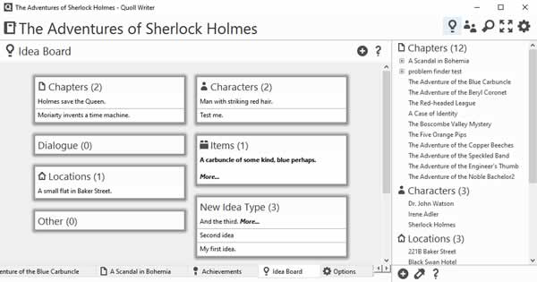

Esta es una aplicación para escribir novelas, y hasta hace poco comencé a utilizarlas. Te digo esta más que nada porque es con la comencé, pero hay muchas más de este estilo.

Estas aplicaciones permiten ordenar por capítulos y escenas, para que dividas muy bien cada parte y le des a cada una el propósito que se merecen. También están los apartados de personajes, escenarios, y algunas incluso te dejan subir las imágenes, cosa que para los dibujantes nos viene de perlas.

Algunas apps incluso permiten entrar es un modo concentrado donde solo están tú, la pantalla y el texto, para evitar distracciones.

También existen unas cuantas aplicaciones para el celular, por lo que si tienes este dispositivo, encuentras opciones incluso más completas que el programa que te mencioné. Dependerá de tus preferencias, hay opciones para todos.

### Editor PDF.

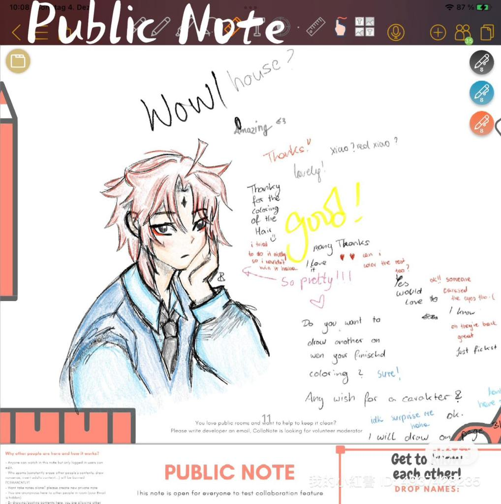

Lo hago un punto general porque aquí ya hay mucho.

En mi caso me gusta utilizar el iPad para hacer storyboard en una app que se llama CollaNote, o en KiloNotes, y la primera solo está para tabletas de Apple.

Las aplicaciones que te menciono son editores de PDF, y como tal expresan, son para hacer anotaciones o trabajar al estilo Word en un documento .pdf, solo que los hago un punto aparte de los procesadores de texto porque aquí hay otras herramientas que no suelen tener estos programas.

En Goodnotes me gusta cargar un PDF que viene numerado como una agenda real (las cuales compro en Etsy), traen secciones como calendario, un horario semanal y un horario diario. No te voy a decir que compres uno de estos archivos porque estos los utilizo para cosas de mi vida diaria y no tanto para hacer cómics y arte.

Te lo menciono porque para hacer storyboard, te puede ser una muy opción para crear tu propia plantilla y subirla en un archivo PDF para luego editarla en un programa como los que te mencioné, o como Xodo o Noteshelf que están disponibles en otros ecosistemas.

De momento, he preferido hacer las miniaturas de mi cómic en ClipStudio porque ya el texto me representa un inconveniente y me gusta manejarme por capas. Los storyboard en formato vertical sí los hago en el iPad porque me deja trabajar como una tira larga y los espacios varían, además de que al tener pocas herramientas me permite enfocarme más en crear y no en organizar.

Estos editores PDF permiten realizar anotaciones, bien a mano alzada o con la herramienta de texto y utilizando un teclado.

Seguro que algunas ves haz bajado uno de estos archivos y que rara vez permiten editar lo que ya está ahí. Aquí es donde vienen útiles las plantillas, porque todo lo que pongas encima, es lo único que podrás modificar y la plantilla seguirá abajo sin ninguna modificación.

En el momento que te escribo esto, estoy planeando crear un nuevo cómic en formato tradicional, pero, claro, los paneles tendrán diferentes tamaños y no todas las hojas tendrán la misma cantidad, entonces, ¿para qué voy a utilizar una plantilla? Porque, en ese caso, necesito enfocarme más en componer el interior del panel y no la hoja como tal. Eso último lo hago en ClipStudio como de costumbre.

Algunos editores PDF te dejan crear archivos desde cero, pues traen sus propias plantillas. Me gustan porque puedo crear una hoja nueva y comenzar a trabajar en la siguiente sin tanto problema. Con ClipStudio puedo fácilmente crear una capa nueva, pero debo ocultar la carpeta anterior y si necesito revisar, tengo que andar activando y desactivando.

Con el editor PDF puedo irme dando una idea de cómo lucirá todo sin tener que gastar tanto papel.

### Aplicaciones de voz a texto.

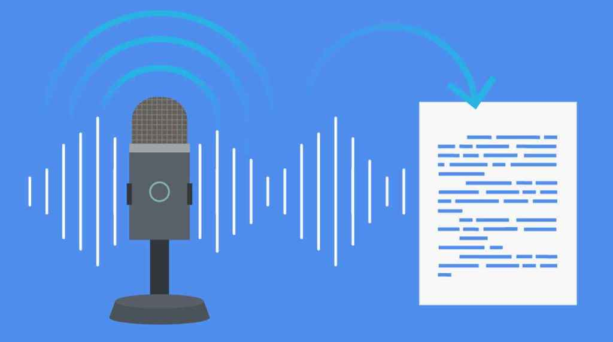

Estas son una nueva incorporación en mi día a día. No las utilizo mucho porque hasta para hablar sola soy introvertida 🤣 (pero ya que voy a grabar vídeos, mejor me acostumbro).

Gracias a la inteligencia artificial, puedes comenzar una nota y luego leerla cuando desees. Claro, también están las grabadoras de voz y después tan solo le picas al botón y escuchas la nota y fin.

En mi caso soy más de preferir leer y no cargar con audífonos, por lo que saber que si tengo las manos ocupadas y tan solo debo hablarle al teléfono y luego leer mi loca idea, es más de mi agrado.

Conocí AudioPen y me interesó más que nada porque utiliza la IA para mejorar tu texto a medida que le hablas. Para el blog, por ejemplo, me sirve bastante. Y si no, hay otras apps que tan solo escriben lo que les hablas, y van dejando tus notas para que las revises con solo un vistazo.

Lo importante, como siempre, es buscar herramientas y quedarte con las que te sean **más útiles** para ti. Yo no utilizo todas las que te mencioné, ni todo el tiempo. Cada una cumple cierto objetivo y otras las he ido reemplazado, no porque sean inútiles como tal, sino que simplemente ya no son lo que busco.

Ya lo mencioné, si una agenda y un bolígrafo te bastan, es lo importante.

Más que nada te pido que evites dejarle todo a tu mente y comiences a trabajar en **escribir tus ideas** en alguna parte. A medida que pasa el tiempo, olvidarás detalles y estos pueden hacer cambiar tu obra por completo.

Por supuesto, eso no significa que si me preguntas, no me acuerdo de nada, ¡tampoco es la idea! Pero muchas veces una palabra o una frase puede cambiar todo, y de una palabra o una frase puede salir una grandiosa historia, ¡no dejes que se escapen!

