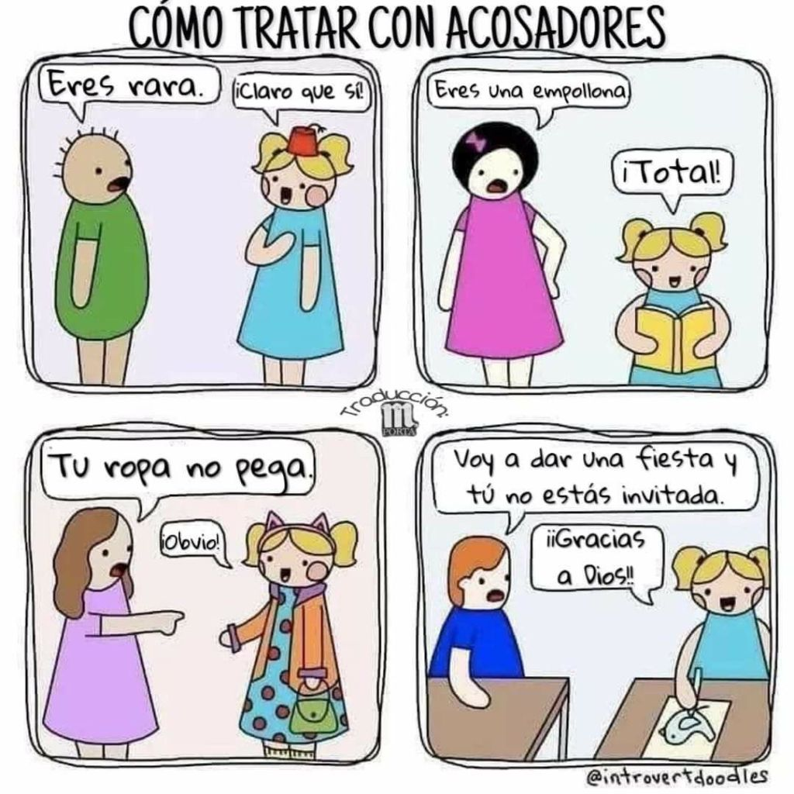

Empezar algo es siempre complicado. Lo bueno es que hoy en día basta una búsqueda en Google o en redes sociales y siempre alguien te dará un buen consejo.

Sin embargo, siento que aún en cómics y mangas hay muchas cosas que no se dice o que descubres cuando ya tienes mucho tiempo creando. No los culpo, pueden ser varios factores que te hagan guardar silencio, como cláusulas en un contrato, o simplemente poco tiempo o ánimo en educar nuevos autores sobre estos temas.

De todos modos, encuentro a personas realizar las mismas preguntas y otra vez, motivo por el cual comencé a escribir este blog. No sé si aún me falta también explorar, pero al menos en español, he encontrado poco contenido sobre cómics y todavía hallo que la barrera del idioma sigue presente y los pocos autores en inglés que comparten su conocimiento, no llegan a muchos aspirantes por esta u otra razón.

Cuando comencé, había preguntas que comenzaron a nacer, otras tantas no hallaba el modo de expresarlas. Incluso hoy después de tanto, siento que al saber qué preguntar, no encuentro respuestas diferentes a lo que encontré hace años.

Por eso y otras razones, me gustaría compartirte un vistazo general a cosas que me hubiera gustado saber desde el inicio y que de seguro muchos artistas se preguntan ahora que comienzan. Cuando tenga la oportunidad, enlazaré una entrada donde expando más el tema en cuestión, por lo que si quieres saber más de un tema, te invito a comentarlo y lo tendré en cuenta para ayudarte con tus dudas 😊

## Sé paciente al obtener resultados.

Una de las cosas que siempre se pasan por alto, es la razón con la que algunas personas ganan suscriptores y clientes.

Puedes encontrar situaciones en las que alguien sube una obra al mismo tiempo o después que tú, con un tema similar, pero a esa persona **le va mil veces mejor** y comienzas a creer que es porque **tu obra es mala**.

El problema aquí es que estamos comparando puntos diferentes. Quizá esa persona ha creado ya tres, cuatro o cinco obras, y aunque no las ves reflejadas en ningún lado, es un **conocimiento** que esa persona **ya ha adquirido**.

**Tú recién estás comenzando**, puede que seas un experto ilustrador, pero no sabes aún contar con precisión una historia, o no sabes de marketing o crear conexiones, llevar redes sociales, o puede ser el simple hecho de que estás publicando en el lugar equivocado.

Claro, algunas personas tendrán suerte y en su primera obra ganan fama, pero esos son casos aislados y no sería de extrañar que su segunda o tercera obra no funcione, porque precisamente **la suerte** no les dejó entender por qué triunfaron.

Tras muchas de las personas que ahora vemos, hay cientos o miles de **horas** que trabajaron en silencio y en soledad, llenas de **fallos** de los cuales aprendieron para poder estar donde están ahora. Acabas de comenzar, y tienes tras de sí apenas un par de horas, así que nada más nos queda ser **pacientes** y construir lo mismo.

## Experimenta y falla, luego aprende e intenta de nuevo.

Para lograr el éxito debes trabajar mucho, como te dije ya en el punto anterior. Y eso, precisamente, se logra **haciendo las cosas**.

Habrá personas que tuvieron la oportunidad de poder experimentar desde niños y hacer miles de dibujos que les dejaron en claro lo que querían hacer. Habrá otros, quizá como yo, que aunque han querido ir tras esa pasión, tuvieron que abandonarlo por alguna razón y tuvieron que comenzar “tarde”, con sus veintitantos años, y quizá otros más que persiguieron esa pasión, pero no tuvieron en claro qué hacer con todo con lo que aprendieron.

No importa dónde estés comenzado, siempre estarás aprendiendo en cada paso que des.

A lo que voy es que el camino estará lleno de altibajos, con muchos errores en el camino. Las primeras veces que crees proyectos serios, te encontrarás con **dificultades** que no veías venir.

Sabiendo que vas a fallar, o sabiendo que quizá no tengas todo lo que deseabas obtener, lo mejor es tomar estos primeros pasos para **experimentar** y no esperar mucho a cambio, dejar dar rienda suelta y dejar escapar tu imaginación para poner a prueba esas locas ideas y luego mejorarlas.

Por cosas como esta, es que recomiendo que [comiences con pequeños proyectos](/blog/posts/2023-10-09-consejos-a-tener-en-cuenta-antes-de-hacer-tu-comic/), precisamente para experimentar y mojarte poco a poco con este arte lleno de diferentes opciones.

## Aprende a tomar críticas.

Continuando, lo malo es que siempre la gente juzgará lo que hagas y algunas veces, por no decir siempre, hablarán sin entender bien la **posición en la que te encuentras**.

Hay críticas siempre, no importa si son bien o mal intencionadas. Por lo menos de esas puedes sacar algo de provecho, pero lo malo viene cuando toman la oportunidad para **burlarse** o hacer de trolls.

Muchos no sabrán que es tu primera obra, y seguro la destruirán como si te trataras del mismísimo Alan Moore, y te criticarán hasta el punto de hacerte desear abandonar todo.

No te lo voy a negar, siempre que ando a revisar comentarios me da un poco de miedo que haya alguien queriéndome decir algo malo, y en especial en estos días que parece que la gente **se toma todo a broma** y te comentan solo memes o algo que nada tiene que ver con lo que publicaste.

Soy una persona que sobre piensa todo, y cualquier cosa que me digan se puede quedar conmigo por años. Aún recuerdo que alguien se **burlaba** del **modo** en el que dibujaba. Yo en ese entonces aún no había tocado un libro de dibujo, tan solo subía lo que hacía a un foro a modo de **hobby**, y solo quería compartir mis ocurrencias sobre ese anime que tanto me encantaba.

A día de hoy puede que me sienta mal, pero sin duda lo mejor que hice fue **ignorar** a esa persona y no responderle su comentario. Sí, dibujaba horrible y yo estaba consciente de eso, pero creo que no era necesario la burla, no me presentaba como una profesional ni pedía dinero, tan solo **compartía** mis dibujos y ya.

Los comentarios útiles siempre se verán de ese modo, incluso las **críticas destructivas**, porque son sinceras, y si las analizas un poco, encontrarás la razón de esas palabras y podrás luego ver que sirven incluso para mejorar tu obra. Sin embargo, las burlas y los trolls son mejor ignorarlos, o comentarles de un modo irónico y sarcástico. Estas viñetas me encantan, y sé que responder de este modo nos puede costar a algunos, pero da una perfecta pista de cómo lidiar con los trolls:

Original de [@introvertdoodles](https://www.instagram.com/introvertdoodles/)

Al final, tú eres el **único** que conoce el camino que ha **recorrido** y todo por lo que ha pasado. Por suerte, más allá de dos o tres situaciones no me he encontrado con gente mala, todos son han sido muy buenos (quizá demasiado), pero si te encuentras tú con alguno que solo quiere **hacerte daño**, recuerda que al final esa persona se habla a sí mismo, quizá producto de la **envidia** de verte triunfar, o porque no tiene nada mejor que hacer.

Deslígate que las críticas, enfócate en mejorar y trabajar.

## No serás el mejor dibujando.

Y no lo digo porque haya gente dibujando **mejor** que tú, sino porque dibujar **no es lo único** que debes aprender si quieres vivir de esto. O cuanto menos, si quieres hacer de tu obra algo conocido.

Siempre dicen que debes dibujar, que si dibujas bien ya llegarán los fans, y por ende, el dinero. Pero como te dije al principio, eso no siempre es así y factores como la **suerte** pueden cambiar todo.

Algunas personas tienen que trabajar más que otras para conseguir lo mismo, ya sea por la clase de amigos que tienen alrededor, el lugar donde crecieron, situación económica y muchas cosas más.

Por ejemplo, aunque a mí me interesaba dibujar, tan solo encontré una persona en todo el colegio que me mencionó que tenía el mismo interés. Y digo mencionar porque el chico era una persona muy reservada y solitaria, no hablábamos más que para saber de la tarea, y yo tampoco era muy sociable. Además de eso, en mi pueblo no había lugares para estudiar dibujo, y cuando me enteré del único que había, luego fue el dinero.

A medida que iba aprendiendo a dibujar y nacieron nuevas **herramientas** como las redes sociales, las cosas se hicieron más **fáciles**. La cosa es que yo nunca me di la tarea a entender las redes sociales, y eso que cuando estudié diseño gráfico, de algo se me habló, pero nunca lo apliqué al dibujo.

También fue que, cuando yo estudié, las redes sociales no eran para nada lo mismo que hoy en día, y nunca se me ocurrió poder **utilizarlas** para hacerme notar. Saber manejar cuentas de por sí es bastante laborioso, y se aplican estrategias que todavía intento entender 😳

Incluso si fuera tremenda experta en Instagram, lo más seguro es que no sabría cómo volver **seguidores en clientes**, porque ya he sabido de casos con gente con más de 10.000 seguidores, y de los cuales no sacan dinero en lo absoluto.

Para ser artista, en resumen, tienes que **aprender a ser un emprendedor**. Eres un trabajador independiente y debes de llevar tu propia empresa. Quizá no es una empresa en el sentido que todos tenemos en la cabeza, en especial por el factor creativo, ¿cómo mezclar esas dos cosas?

A día de hoy sigo averiguando por mi parte sobre eso, soy un poco lenta con esa clase de cosas 😅 Pero sí entendí que mi habilidad para dibujar, aunque sea la mejor, **no basta.** No a todos nos adoptará un mecenas ricachón, ni llegará un manager que nos salvará la vida, o un presentante que nos llevará a la cima, al resto de los mortales nos queda aprender sobre **marketing, networking, contabilidad** y quién sabe qué cosas más.

## Ocúpate de crear, lo demás vendrá después.

Aunque te mencioné ya que hay muchas cosas que puedes aprender, con eso no me refiero a que ahora debes tener tu mente tan ocupada que con suerte tendrás tiempo para dibujar. ¡Ni mucho menos!

Como te dije desde el principio, la diferencia entre el que tiene éxito y el que no, son la **clase de conocimientos** que tiene.

Con un buen horario, estoy segura de que podrás **dedicar tiempo a aprender** sobre todo, pero sé que no todos tienen la misma suerte, por lo que el poco tiempo que te sobra, si es tu caso, te aconsejaría que lo uses para crear.

Bueno, y es que el punto anterior también lo enfocaba a aquellos que quieren hacer dinero.

Comenzamos a crear porque es divertido y nos llena de uno modo u otro, por lo que abandonar en su totalidad el dibujo no es algo que le pida a alguien ni que haya hecho yo para siempre (aunque un par de veces me dan crisis 😅).

Hay periodos en los que me siento **cansada**, y distraer mi mente en aprender otra cosa me ayuda, así como te explicó en un siguiente punto.

La cosa es que, ¿para qué vas a aprender tantas cosas si dejas de lado la **razón** por la que nació todo?

Si tienes ganas de crear, crea, crea y crea. Un modo de darte a conocer es, precisamente, mostrando lo que haces. No sabemos aún cómo puede ser que logres reconocimiento, pero sería bueno que algo te respaldara, ¿no?

Así que no te preocupes en aprender técnicas especiales o en adquirir todos los conocimientos para ponerte manos a la obra. Una vez que comienzas, será difícil detenerte, y poco a poco aprenderás todo lo necesario. Ya te dije, debes ser paciente, pero aún más importante es **comenzar**.

## Enfócate en metas que puedes controlar.

Ya sea porque nos han dicho un número mágico, o porque creemos que al tener **más seguidores** nuestro trabajo es mejor, comenzamos a obsesionarnos con crecer nuestros seguidores. Ya sea en Instagram, TikTok o en Webtoon al subir nuestros cómics.

Este punto lo toco principalmente porque esto es algo que uno **no puede controlar**. Si bien es verdad que cuando destacas en algo, comienzas a atraer la atención de las personas, pero debes recordar precisamente que es en ese orden, y no que al tener más seguidores, eres mejor.

Hay veces en que obras o artistas tienen muchísimos seguidores, pero eso no es un reflejo de la **calidad** de lo que hacen (o incluso de lo que **son**), y por eso, si a pesar de estar trabajando mucho sigues estancado en cien o quinientos seguidores, deberías evaluar qué es lo que falla y no creer que es porque eres un **mal dibujante** o creador.

Hay artistas **profesionales** que han trabajado en grandes obras como en películas de DreamWorks, amadas por todos, como puede ser Sherk, pero sus seguidores en redes sociales son apenas unos **miles** y las interacciones en sus posts son apenas de tres **cifras**.

Ellos son increíbles en sus áreas, y han trabajado precisamente en eso, ser **mejores**. Un número en un sitio web no es nada, porque no refleja… nada, en realidad. Estos artistas que te doy de ejemplo, se ganan la vida precisamente en otro lugar, consiguiendo clientes fuera de las redes sociales, porque al final, **tener más seguidores no es lo que paga**.

Una vez más, no te voy a mentir, porque también me he llegado a molestar o entristecer al ver que no llego a muchas personas. Pero me he dado cuenta de que eso se debe más que nada porque no tuve un **plan** para enfocarme precisamente en lo que yo **puedo controlar:**

Puedo controlar **ser mejor** artista, puedo controlar **la calidad** de mi contenido, puedo controlar **la cantidad** de creaciones que hago y mucho más. Pero no puedo controlar que a las personas **les guste** lo que hago, no puedo controlar **sus opiniones** ni controlar que **hablen** de ellos a sus amigos y familiares.

Sé que esto es algo difícil, porque el único *progreso* medible que tenemos, es ese número en redes sociales o donde sea que publiques. Frente a nosotros nunca aparecerá una barra que indique qué tan buenos artistas somos, no nos dirá que vamos al 52% o que nos falta 10% para ser los *masters* en lo que sea que hagamos.

Por eso te mencionaba que te enfocaras en crear, porque al final, es lo **único** que puedes **hacer**, y lo demás, ya vendrá después.

## Primero tú, luego tu obra y luego tus fans.

Algo que siempre preocupa a los creadores, en especial de Webtoon, es que deben subir **todas** las semanas un **nuevo** capítulo. Se afanan en crear y crear, preocupados por los **pobrecitos** fans a los que les entregan contenido **gratis**.

En este caso lo encuentro ridículo, porque no estás ligado a un contrato que te **obligue** a crear a cambio de una paga, y se martirizan por un número que deben hacer crecer y que no les da nada a cambio, así como dije ya más arriba.

No te voy a decir que esas cosas nunca me preocuparon, mentiría si fuera así. La cuestión es que hay personas que se llegan a obsesionar tanto que temen irse de hiatus para **descansar**, y se **disculpan** de mil maneras con los fans como si les **debieran** la vida entera por no publicar una semana (no te disculpes, solo avisa y ya).

Una de las razones por las que las personas dejan su cómic de lado es porque ya se cansaron de **crearlo**. Imagínate, es como dejar a tu pareja estando enamorado todavía de esta, ¡suena horrible!

Si te sientes agotado, descansa. Si no te apetece dibujar, no lo hagas. No te presiones por responderle a unos fans que solo le picaron *like* a tu obra. No pretendo sonar mala contra los seguidores, porque después de todo, parte de la motivación para seguir, son ellos. Pero quiero que te quede en claro esto: son tus fans, no tus clientes. La diferencia es cómo debes responderles a estos.

Por supuesto, si tienes un Patreon o Ko-fi con personas que ya te pagaron un mes de mecenazgo, es obvio que debes responder por lo ya pagado, pero muchos otros no reciben dinero por las visitas de sus obras, y matarse horas por algo no redituable es algo que no le recomiendo a nadie hacer.

Ahora me dirás que soy una interesada 🤣, que solo quiero dinero de mis lectores. Y bueno, ¿por qué no? ¿A quién no le gustaría que se le pagara por dibujar 8 horas en algo que le gusta crear? Hay personas siendo pagadas por **dormir**, ¿por qué no merezco que me paguen por una obra que tardé tanto en crear y que otros también disfrutan?

Pero hasta que eso no ocurra, no puedo estar desgastando mi cuerpo en una paga **ficticia**. Cuida de tu salud física y mental, porque si te agotas pronto, tendrás que dejar de lado tu pasión y algo mucho peor.

Recuerda el orden: **primero** **tú**, luego tu obra, y luego tus fans.

Cuida de ti para poder crear y luego así llegar a tus fans. Periodos de descanso son **importantes** para continuar trabajando, no temas en tomar un día, semana o meses si lo crees necesario, saturar tu mente y tu cuerpo con solo una cosa no es sano, por más que lo disfrutes.

Estos son algunos consejos que incluso me tengo que recordar durante el día, y no solo le sirven a principiantes, sino a cualquiera que tenga dudas y que estén en otra área de trabajo.

Hay muchas cosas que me gustaría compartir respecto a la creación de cómics, pero hay cosas tan vagas o tan específicas que creo se beneficiarían más de otro formato (como vídeos, los cuales subo en mis redes sociales 😉), pero traté de tocar aquí de un modo más general y de temas que siento **poco** se hablan.

Tal vez regrese con nuevos consejos, pero te invito, por ahora, a que estés al tanto de las próximas entradas donde complemento algunas cosas que mencioné aquí, como el **manejo del tiempo** o cosas que deberías saber más allá del dibujo.

¡Hasta otra!