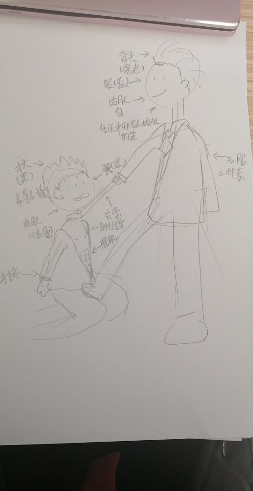
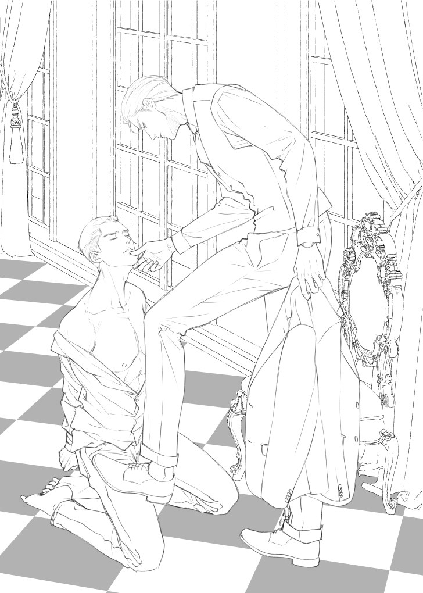

La inteligencia artificial es maravillosa. Suponiendo que la estamos utilizando adecuadamente.

Siempre soñamos con que, al despertar, una máquina nos prepararía todo para antes de marchar a la escuela o al trabajo, y al regresar, la casa estaría impecable, dejando las pesadas tareas como cosa del pasado.



¿Qué haríamos entonces con tanto tiempo? ¡Crear! Al fin tendríamos todo el tiempo que deseábamos para enfrascarnos en nuestra pasión: dibujar, escribir, crear música…

Pero hoy, hoy no es así. Hoy la inteligencia artificial realiza todo lo que YO he querido hacer, no lo que he querido dejar de hacer.

Hoy todavía tengo que ocuparme de lavar los platos, pensar en la cena y aspirar debajo de los muebles. Padres y empleados que buscan cómo ahorrar tiempo de sus quehaceres para sus pasatiempos, lo ven cada día más difícil.

La inteligencia artificial no es la maravillosa herramienta que me prometieron.

Es verdad que para algunas tareas resulta cómodo utilizarla. Una de las partes que más detesto es comprimir mis pensamientos en un *copy* para Instagram, y le pido a una de estas IA que me ayude a escoger lo mejor de lo mejor, y problema resuelto.

Bueno, o al menos me ayuda a guiarme, porque siempre debo estar corrigiendo detalles. Son pequeñas tareas que hacen parte de mi trabajo, sencillas, pero que me consumen mucho tiempo al no tenerles práctica.

Todo sale al oprimir las teclas unas cuantas veces, y luego de dar *enter*, puede salir una hermosa imagen, un gran texto o una pegadiza melodía. Y ahora, por culpa de eso, creen que los artistas lo han hecho siempre así de fácil.

Como artistas, sabemos que el proceso no es sencillo. Dando de ejemplo la ilustración: composición, color, anatomía y miles de cosas más pasan por nuestro cerebro antes de completar una imagen. Total, que lo único que importa es cómo se ve todo al final, al cliente o espectador todo eso *le vale.*

La inteligencia artificial ha complicado todo.

Cuando comencé a buscar maneras de como crecer mis redes sociales, siempre decían que publicara más. ¡Imposible! ¿Cómo iba a tener una ilustración completamente renderizada a diario?

Trataba mi cuenta de Instagram como un portafolio que debía ser impecable, perfecto, con mis mejores obras. Así era también en DeviantArt, incluso mi cuenta personal de Facebook.

Si me comparo a la velocidad de unos clics y los días en que tardo yo, en términos de crear más, sin duda la IA gana. Eso suena desesperanzador. La gente se aburriría de esperar por una ilustración a la semana, y la IA ganaría al sacar cinco o más imágenes a diario.

Pero un consejo que comencé a recibir, era que no era necesario crear todos los días. Bueno, eso es sin duda un alivio. Igual, yo seguía sin saber qué subir a mis redes sociales.

¿Entonces qué era lo que tenía que hacer? Mostrar más las otras cosas que soy. Aquí es donde entra el tal consejo que me ayudaría a crear más contenido: mostrar el proceso de creación de una obra.

Antes he mencionado que nuestro trabajo, como decía Steve Jobs, es conectar los puntos. La cuestión es que no se trata solo de saber de anatomía y teoría del color, sino también del lugar donde nacen las ideas y cómo se convierte en la pieza final. Cómo pasó todo del punto A al punto B.

Recuerdo bien la vez que una artista que sigo, quien se dedica a crear portadas para novelas, compartió el bosquejo del cliente, y junto a este, la ilustración que ella realizó. Sé que como artista, soy más curiosa sobre el proceso, pero eso no quita que muchos de sus seguidores no artistas estaban igualmente asombrados: potenciales clientes que ven cómo su idea encuentra su lugar.

[Leila's Artwork](https://www.facebook.com/leilalee015)

Mostrar cómo nació la imagen, qué se va a hacer con ella y cómo afronte el reto, es un modo fácil de crear contenido. Puedo sacar cuanto menos tres imágenes o vídeos, hablando sobre la obra y de cómo evoluciona esta. Si es el trabajo de un cliente, es un modo sencillo de comentar cómo solucioné su problema.

Pero no se trata tan solo de crear más contenido para las redes sociales, porque, regresando al ejemplo de la artista que te menciono, ella no sube todo lo que hace, ni todos los días, ya que está más dedicada a sus clientes que a conseguir más seguidores.

Entonces, ¿por qué mostrar el proceso? Es sencillo: porque eres humano. Este es el modo en que puedes crear tu marca y acercarte a tus seguidores.

Aunque todos los problemas tienen solución, el cómo se soluciona o por qué necesito cierta solución en concreto es lo que hace que un cliente o seguidor nos busque.

Por más que en el fondo trabajemos con las mismas herramientas, el cómo las utilizamos en realidad es lo que más importa. El cliente puede no entender nada de lo que hacemos, pero puede estar muy seguro que de que la solución que le damos en la más adecuada.

En un principio, me asombraba ver lo que una computadora era capaz de crear, pero ahora noto que siempre hace lo mismo y, si un sitio web o emprendimiento usa una de estas imágenes, desentona mucho con el resto del mensaje que me quieren transmitir. No puedo confiar en que solucionen mi problema si fueron muy vagos para solucionar los suyos propios.

Mostrar el proceso de tu trabajo demuestra por todo lo que tienes que pasar para crear esa obra. Es una conexión que demuestra cuáles son tus valores, tu misión y tu visión, elementos importantes para crear una marca.

La máquina jamás entenderá sobre eso, incluso así arroje cientos de palabras explicándolo (porque no comprende esas palabras). Yo no sigo artistas tan solo por como dibujan, también lo hago por lo que representa ese trabajo para ellos y el mensaje que me dan.

Sube tu proceso, muestra tus valores, tus objetivos y tus sueños, esa es tu marca. Eres un humano.